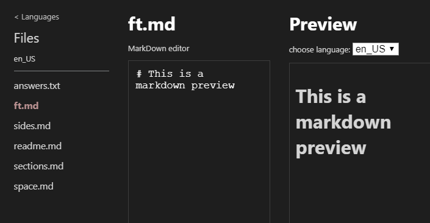

# Policy Models Support for Visual Studio Code <!-- omit in toc -->

## Overview <!-- omit in toc -->

This plugin adds support for **Policy Model** languages in **Visual Studio Code** (more about Policy Models can be found [here](https://datatagginglibrary.readthedocs.io/en/latest/index.html#)).
This project is composed from an **LSP Client** and **LSP Server**.
Both the Client and Server use **Tree-Sitter** Parsers to parse the languages (the client uses it for syntax highlighting and the server for the rest of the language features).

#### Table of contents  <!-- omit in toc -->

- [Installation](#installation)
	- [Pre-requisites](#pre-requisites)
	- [Instructions](#instructions)
- [Features](#features)
	- [Syntax Highlighting](#syntax-highlighting)
	- [Go To References](#go-to-references)
	- [Go To Definition](#go-to-definition)
	- [Auto-Complete](#auto-complete)
	- [Create New Model](#create-new-model)
	- [Running Model](#running-model)
	- [Localization](#localization)
	- [Graphviz Visualization](#graphviz-visualization)
- [Supported Settings](#supported-settings)
- [Development Guide](#development-guide)
- [Related](#related)

## Installation
[TODO: wait for packaging and release]

### Pre-requisites
- **VSCode 1.41**
- **Java JDK 11.0.4**
- **Graphviz**

### Instructions

## Features
### Syntax Highlighting

### Go To References
We support references of Decision Graph nodes (that have an ID), Policy Space slots and Policy Space slot-values.
 

### Go To Definition
We support definitions of Decision Graph nodes (that have an ID), Policy Space slots and Policy Space slot-values.
 

### Auto-Complete
Press **ctrl + space** (default VSCode shortcut) to recieve a completion list. The completion list includes keywords dependant on the file type, Decision Graph nodes (from imported graph files), slots and slot-values.

### Create New Model
Press the **New Model** button:

Next fill out the necessary information:

### Running Model
Press the **Run Model** button:

This will run the [CLI](https://datatagginglibrary.readthedocs.io/en/latest/take-for-spin.html) and load the model into it:

### Localization

Pressing the Localization will open our Localization GUI.
If a Localization folder does not already exist, you will promped to first create one.

The Localization GUI allows for simple editing of the "**answers.txt**" and "**space.md**" files:

We also provide a Markdown preview of the markdown files of the localization:

### Graphviz Visualization
[TODO: add images & description]

## Supported Settings
[TODO: add images]

## Development Guide

## Related

- [Policy Models](https://datatagginglibrary.readthedocs.io/en/latest/index.html#)
- [DataTaggingLibrary project](https://github.com/IQSS/DataTaggingLibrary)
- [LSP](https://microsoft.github.io/language-server-protocol/overviews/lsp/overview/)
- [VSCode Language Extensions](https://code.visualstudio.com/api/language-extensions/overview)
- [Tree-Sitter](http://tree-sitter.github.io/tree-sitter/)