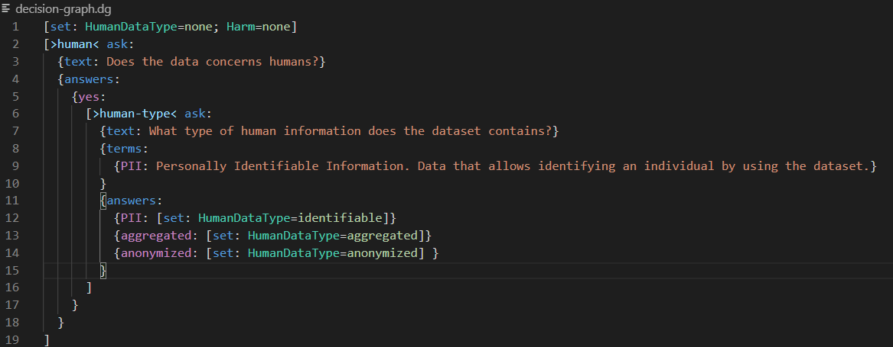

# Policy Models Support for Visual Studio Code <!-- omit in toc -->

More about Policy Models can be found [here.](https://datatagginglibrary.readthedocs.io/en/latest/index.html#)

#### Table of contents  <!-- omit in toc -->

- [Features](#features)
	- [Syntax Highlighting](#syntax-highlighting)
	- [Go To References](#go-to-references)
	- [Go To Definition](#go-to-definition)
	- [Auto-Complete](#auto-complete)
	- [Localization](#localization)
	- [Graphviz Visualization](#graphviz-visualization)
	- [Create New Model](#create-new-model)
	- [Running Model](#running-model)
- [Supported Settings](#supported-settings)
- [Changelog](#changelog)
- [Latest Build](#latest-build)
- [Development Guide](#development-guide)
- [Related](#related)

## Features

### Syntax Highlighting

### Go To References

### Go To Definition

### Auto-Complete
press **ctrl + space** to recieve a completion list:

### Localization

### Graphviz Visualization

### Create New Model

### Running Model

## Supported Settings

## Changelog

## Latest Build

## Development Guide

## Related

- [Policy Models](https://datatagginglibrary.readthedocs.io/en/latest/index.html#)
- [DataTaggingLibrary project](https://github.com/IQSS/DataTaggingLibrary)
- [LSP](https://microsoft.github.io/language-server-protocol/overviews/lsp/overview/)
- [VSCode Language Extensions](https://code.visualstudio.com/api/language-extensions/overview)
- [Tree-Sitter](http://tree-sitter.github.io/tree-sitter/)