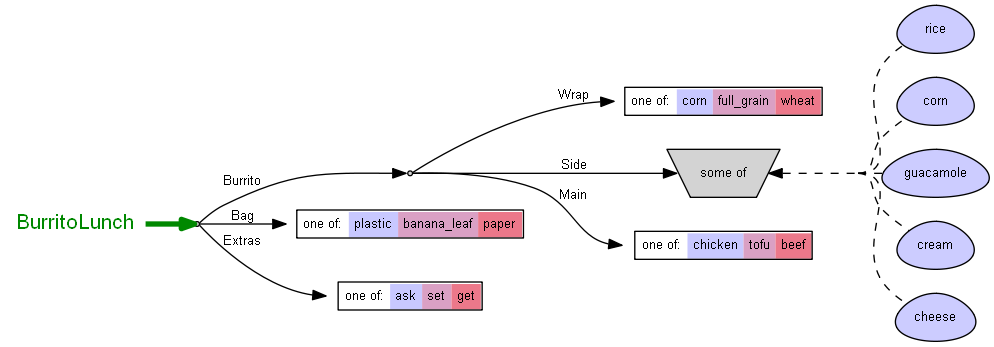

# Policy Models Support for Visual Studio Code <!-- omit in toc -->

## Overview <!-- omit in toc -->

This plugin adds support for **Policy Model** languages in **Visual Studio Code** (more about Policy Models can be found [here](https://datatagginglibrary.readthedocs.io/en/latest/index.html#)).
This project is composed from an **LSP Client** and **LSP Server**.
Both the Client and Server use **Tree-Sitter** Parsers to parse the languages (the client uses it for syntax highlighting and the server for the rest of the language features).

#### Table of contents  <!-- omit in toc -->

- [Installation](#installation)
	- [Pre-requisites](#pre-requisites)
	- [Instructions](#instructions)
- [Features](#features)
	- [Syntax Highlighting](#syntax-highlighting)
	- [Go To References](#go-to-references)
	- [Go To Definition](#go-to-definition)
	- [Auto-Complete](#auto-complete)
	- [Create New Model](#create-new-model)
	- [Running Model](#running-model)
	- [Localization](#localization)
	- [Graphviz Visualization](#graphviz-visualization)
- [Supported Settings](#supported-settings)
- [Understanding Errors](#understanding-errors)
- [Development & Contribution](#development--contribution)
- [Related](#related)
	- [Policy Models](#policy-models)
	- [DataTaggingLibrary Project](#datatagginglibrary-project)
	- [Language Server Protocol](#language-server-protocol)
	- [VSCode Language Extensions](#vscode-language-extensions)
	- [Tree-Sitter](#tree-sitter)
		- [Decision Graph Parser](#decision-graph-parser)
		- [Policy Space Parser](#policy-space-parser)
		- [Value Inference Parser](#value-inference-parser)
	- [Syntax Highlighting in VSCode using Tree-Sitter](#syntax-highlighting-in-vscode-using-tree-sitter)

## Installation
[TODO: wait for packaging and release]

### Pre-requisites
- **VSCode 1.41** : last compatible version verified.
- **Java JDK 11.0.4** : required for creating [new models](#create-new-model), [running existing models](#running-model) and [localization files creation](#localization).
- **Graphviz**: required for [visualization feature](#graphviz-visualization). Can be download [here](#http://www.graphviz.org/).

### Instructions

## Features
### Syntax Highlighting

### Go To References
We support references of Decision Graph nodes (that have an ID), Policy Space slots and Policy Space slot-values.

### Go To Definition
We support definitions of Decision Graph nodes (that have an ID), Policy Space slots and Policy Space slot-values.

### Auto-Complete
Press **ctrl + space** (default VSCode shortcut) to recieve a completion list. The completion list includes keywords dependant on the file type, Decision Graph nodes (from imported graph files), slots and slot-values.

### Create New Model
Press the **New Model** button:

Next fill out the necessary information:

### Running Model
Press the **Run Model** button:

This will run the [CLI](https://datatagginglibrary.readthedocs.io/en/latest/take-for-spin.html) and load the model into it:

### Localization

Pressing the Localization will open our Localization GUI.
If a Localization folder does not already exist, you will promped to first create one.
To Learn more about how these files are managed, see [here](#https://datatagginglibrary.readthedocs.io/en/latest/localizations.html).

The Localization GUI allows for simple localization files editing.
You will get a structured editor for "**answers.txt**" and "**space.md**" files:

And a free markdown editor for the rest of the .md files

We also provide a Markdown preview for the markdown files, in any available language

To create new language localization press the + button

### Graphviz Visualization
It is possible to create a graphical visualization of the model using Graphviz ([must be pre-installed](https://datatagginglibrary.readthedocs.io/en/latest/tutorial/system-setup.html?highlight=graphviz#optional)).

There are 2 kinds of visualizations:
- Decision Graph visualization
- Policy Space visualization

Each has correpsonding button in the plugin:

After pressing the button, provide the path to the graphviz application (dot file), Example paths:

- **Windows** `C:/Program Files (x86)/Graphviz2.38/bin/dot.exe` 
- **macOS** `/usr/local/bin/dot` 

The provided path will be save in a file on the path `.../PolicyModelsPlugin/client/out/Graphviz/graphvizConfig.txt` and is necessary configuration for the feature to work.

After that, provide file name and format (check [here](https://graphviz.org/doc/info/output.html) for all available Graphviz formats).

This will generate the file under a new `visualization/type` folder:

Policy Space Graphviz graph output example:

## Supported Settings
in order to enable or disable any of the options below, you will need to have a folder named .vscode in the project folder. Inside this folder you will need a file named settings.json. If the file exists use the existing one.

# Code Diagnostics (syntax erros highliter)
This ability is disabled by default. To enable add to settings.json this: "PolicyModelsServer.Diagnostics": true

# Plugin Logging
Logging of the LSP server has 2 domains:
1. Server trace - all the messaged sent between the client and server. they can be seen in VS-Code consle. To enable add: "PolicyModelsServer.trace.server": "verbose"
2. Logging - this is a logging domain used by our code and writes the information to files saved in the plugin location on the computer under Logs folder. "PolicyModelsServer.Logging": true

setting file example with all options enabled:

## Understanding Errors

[For information regarding possible errors encountered in this plugin, please refer to this guide](docs/ERRORS.md).

## Development & Contribution

[For contributing to this project, please refer to this guide](docs/CONTRIBUTING.md).

## Related

### Policy Models
This plugin is designed to streamline and simplify the process of creating Policy Model projects. Learn more about [Policy Models](https://datatagginglibrary.readthedocs.io/en/latest/index.html#).

### DataTaggingLibrary Project
Some of the features in this project are provided by an existing open-source project, the [DataTaggingLibrary Project](https://github.com/IQSS/DataTaggingLibrary),  that provides a Command Line Interface for creating and running Policy Model projects.

### Language Server Protocol
>Implementing support for features like autocomplete, goto definition, or documentation on hover for a programming language is a significant effort. Traditionally this work must be repeated for each development tool, as each provides different APIs for implementing the same features.
The idea behind a Language Server is to provide the language-specific smarts inside a server that can communicate with development tooling over a protocol that enables inter-process communication.
The idea behind the Language Server Protocol (LSP) is to standardize the protocol for how tools and servers communicate, so a single Language Server can be re-used in multiple development tools, and tools can support languages with minimal effort.

Learn more about [LSP](https://microsoft.github.io/language-server-protocol/overviews/lsp/overview/).

### VSCode Language Extensions
This plugin is a VSCode Language Extension. These extensions provide additional support for more languages in the VSCode editor.
Learn more about [VSCode Language Extensions](https://code.visualstudio.com/api/language-extensions/overview).

### Tree-Sitter
>Tree-sitter is a parser generator tool and an incremental parsing library. It can build a concrete syntax tree for a source file and efficiently update the syntax tree as the source file is edited. Tree-sitter aims to be:
General enough to parse any programming language
Fast enough to parse on every keystroke in a text editor
Robust enough to provide useful results even in the presence of syntax errors
Dependency-free so that the runtime library (which is written in pure C) can be embedded in any application

Learn more about [Tree-Sitter](http://tree-sitter.github.io/tree-sitter/).

For this project we have created 3 new Tree-Sitter parsers, one for each language in Policy Models. These parsers are standalone [npm](#https://www.npmjs.com/) packages and can be used in other projects freely.

#### Decision Graph Parser
This parser can be found at https://www.npmjs.com/package/tree-sitter-decisiongraph.

#### Policy Space Parser
This parser can be found at https://www.npmjs.com/package/tree-sitter-policyspace.

#### Value Inference Parser
This parser can be found at https://www.npmjs.com/package/tree-sitter-valueinference.

### Syntax Highlighting in VSCode using Tree-Sitter
At the time of this writing, LSP does not fully support Syntax Highlighting. Therefore we implemented this on the Client's side. We chose to use the Tree-Sitter parsers for the syntax highlighting, instead of the native Text-Mate support in VSCode, to allow easier maintainability. This was based on the wonderful work in this [project](https://github.com/georgewfraser/vscode-tree-sitter).