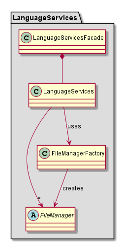

# Contributing <!-- omit in toc -->

#### Table of contents  <!-- omit in toc -->

- [Read This Before Contributing!](#read-this-before-contributing)
	- [VSCode Language Extensions](#vscode-language-extensions)
	- [Language Server Protocol](#language-server-protocol)
	- [Tree-Sitter](#tree-sitter)
- [Expanding the LSP Client](#expanding-the-lsp-client)
	- [Syntax Coloring](#syntax-coloring)
- [Expanding the LSP Server](#expanding-the-lsp-server)
	- [Language Capabilites](#language-capabilites)
	- [Language Services](#language-services)
- [Expanding the Language Parsers](#expanding-the-language-parsers)
- [Expanding Java Code and Updating JARs](#expanding-java-code-and-updating-jars)
	- [Running Model](#running-model)
	- [LibServiceAPP](#libserviceapp)
	- [New Model Creation](#new-model-creation)
- [Server Logging](#server-logging)

## Read This Before Contributing!
This project is a VSCode language extension that uses the LSP architecture.
Therefore before any contributions can be made, it is important to first familiarize yourself with the following information: 

### VSCode Language Extensions  
Learn about [VSCode Language Extensions](https://code.visualstudio.com/api/language-extensions/overview).

### Language Server Protocol  
Learn about [LSP](https://microsoft.github.io/language-server-protocol/overviews/lsp/overview/).
There is also a good [example-project](#https://github.com/Microsoft/vscode-extension-samples/tree/master/lsp-sample) that contains both a client and server.
 The server is using LSP 3.1.15 protocol version.

### Tree-Sitter 
Learn about [Tree-Sitter](http://tree-sitter.github.io/tree-sitter/) and our language [parsers](./../README.md#Decision-Graph-Parser).

In this project we use the **web-tree-sitter** project (can be found at https://www.npmjs.com/package/web-tree-sitter) to generate the parsers in _.wasm_ format. The parsers are located in the _Parsers_ directory under root. Both the client and server use this directory. Therefore if anyone wishes to use only one of them, it is necessary to also include the parsers in the new project.

## Expanding the LSP Client

### Syntax Coloring
Syntax coloring in VSCode uses Text-Mate grammers (as described at https://code.visualstudio.com/api/language-extensions/syntax-highlight-guide). **However**, for easier maintainability we wanted to use our Tree-Sitter parsers for the syntax coloring, instead of having to maintain 2 different grammers.
Our syntax coloring is heavily inspired by the works in this [project](https://github.com/georgewfraser/vscode-tree-sitter).
Our coloring functions are located [here](./client/color/../../../client/src/color/colors.ts). There is a coloring function for each language which maps different syntax nodes to different color themes. To change the coloring, simply edit the way the function maps the themes.

## Expanding the LSP Server

### Language Capabilites

The server currently supports the following capabililtes: [Auto-complete, Go To references, Go To Definition](./../README.md/#features) and [Error highlighting](./../README.md/#Syntax-Errors-Highlighter-(Code-Diagnostics)). If you wish to add new capabilites to the server you first need to familiarize yourself with the [LSP protocol](#language-server-protocol).
 To enable more capabilites you need to add the relevant settings in the server capabilites response to client in [code](./../server/src/server.ts).

### Language Services

To answer LSP requests we have implemented language features which can be found in the following files:
- [LanguageUtils](../server/src/LanguageUtils.ts)
- [LanguageServices](../server/src/LanguageServices.ts)

**LanguageUtils** holds a collection of static methods that store no information and cause no side-effects. They answer basic queries on a given syntax tree.
**LanguageServices** composes the methods mentioned above to answer more complicated queries regarding several syntax trees.

The general structure is as shown in this _minimal_ class diagram:

- **LanguageFacade** exposes an LSP-like interface for the other components in the Server. It acts as an adapter between the rest of the Server classes and **LanguageServices** class.
- **LanguagServices** answers language queries regarding a workspace of a Policy Model. This class holds several **FileManager** instances, each representing a file in said workspace.
- **FileManagerFactory** is pretty self-explanatory: creates **FileManager** instances.
- **FileManager** represents a Policy Model file. Answers language queries regarding a single file.

To add more functionalities will require changing the **LanguageFacade** class and, if need be, the rest of the classes to support the new queries.
To change / optimize the algorithms that answer the queries, please make new classes that inherit from **FileManager** )note that this is an _abstract_ class) and change the **FileManagerFactory** to create instances of these new classes.

## Expanding the Language Parsers

Our parsers are made using [Tree-sitter](#tree-sitter). You must first familirize yourself with creating such parsers.
If you want to modify the language parsers, look at the  repositories of the [parsers](./../README.md#Decision-Graph-Parser).
After changing the parser projects, the WebAssembly parsers in the _Parsers_ directory must be updated as well. There is a [script](./../scripts/gen-parsers.sh) for that, however it currently only works on **Linux**.

## Expanding Java Code and Updating JARs

The project uses java code and external Jars to enable the features: [Grpah visualization](./../README.md/#graphviz-visualization), [Localization file creation](./../README.md/#localization), [New model creation](./../README.md/#create-new-model) and [Running model](#./../README.md/running-model).

### Running Model
To run the model we are using the CLI Jar located [here](./../cli/PolicyModels-1.9.9.uber.jar). this Jar is taken from [Policymodel CLI](https://github.com/IQSS/DataTaggingLibrary/releases). This Jar can be updated freely because it is only used for running the model, and has no code dependency.

### LibServiceAPP
Graph visualization, Creating localization files and New model creation features use the [LibServiceApp Jar](./../cli/LibServiceApp.jar).
 This jar is generated from the code located [here](./../LibServiceApp).
 When generating this jar you need to make sure that all Jar files in the [resources folder](./../LibServiceApp/resources) are also used as dependencies to this jar.

The LibServiceApp code is also using [CLI Jar](./../LibServiceApp/resources/PolicyModels-1.9.9.uber.jar) (different path to jar from the Running Modle jar, thus updating one won't affect the other). The [LibServiceApp](./../LibServiceApp) code is tightly coupled to the [CLI Jar](./../LibServiceApp/resources/PolicyModels-1.9.9.uber.jar), So be careful when updating the CLI Jar.

### New Model Creation
Creating new model has another [JAR](./../LibServiceApp/resources/GuiApp.jar), this is the input form it is generated form the code in [here](../../LibServiceApp/GuiApp). When generating this jar make sure to include all the jackson jars (3 jars) located in the [resources folder](./../LibServiceApp/resources).

## Server Logging

The logging in the server is based on [Winston logger](https://www.npmjs.com/package/winston).
  By default logging is disabled. To activate it see [here](./../README.md/#Plugin-Logging).
 When activating the logging you can have only one instance of VSCode open with the logging activated.

### How to Use <!-- omit in toc -->
You can't use logging before the initLogger function is called. This function is called after the client finished initialization.

How to log:
use the getLogger function from [Logger](./../server/src/Logger.ts) with the relevatnt logging domain.

Logger files are created in the plugin location dir (VScode installation dir) under Logs folder.

#### Logging domains: <!-- omit in toc -->
- serverHttp - To log any requests recieved from client.
- server - For logging in [Solver](./../server/src/Solver.ts) and [server](./../server/src/server.ts)
- documents - For loggin in [documents](./../server/src/Documents.ts) and [document manager](./../server/src/DocumentManager.ts)
- parser - For logging relevant to [Language Services](#Language-Services)

The globalLog.log file has the logging infromation from all domains together. 
The Log also log all errors to a file named unhandeled_exceptions.log.