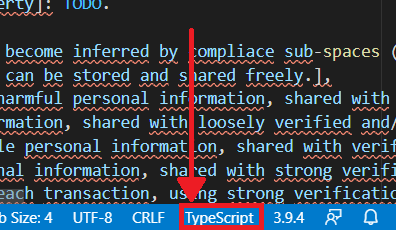

# Understanding Errors <!-- omit in toc -->

#### Table of contents  <!-- omit in toc -->
- [Syntax Errors](#syntax-errors)
- [Logging](#logging)
- [LibServiceApp Requests](#libserviceapp-requests)
- [Generating New Model](#generating-new-model)
- [TS Files](#ts-files)

## Syntax Errors
Due to limitations on error handling in Tree-Sitter, it is currently not possible to provide meaningful error descriptions when the Model has syntax errors. For that reason we do not enable by default our [LSP diagnostics](#https://microsoft.github.io/language-server-protocol/specification#diagnostic), as it is rather bare-bones right now.

If you wish to enable them in your Model, please see instructions [here](../README.md#supported-settings).

## Logging
See [here](./CONTRIBUTING.md/#server-logging).

## LibServiceApp Requests
The features: [graph visualization](./../README.md/#graphviz-visualization), [localization file creation](./../README.md/#localization) and [new model creation](./../README.md/#create-new-model) are all HTTP requests to a java server ([server code](./../LibServiceApp), [server JAR](./../cli/LibServiceApp.jar)).

Any errors regarding connection issues or HTTP requests failures are connected to this files and code. Most common cause to this kind of problems is bad Java JDK installation or Path settings, for installation instructions look [here](./../README.md/#installation).

To make sure Java is set correctly run the Java server by yourself from command line by entering Java -jar LibServiceApp.jar command when in cli folder. If the activation server worked you should see a print of ready with some port number.

Common issues:
- class not loaded error - this means when generating the [LibServiceApp Jar](./CONTRIBUTING.md/#LibServiceAPP) the jars in the resources folder weren't added as dependencies to the jar.

## Generating New Model
Generating new model is based on [Policymodel tools JAR](https://github.com/IQSS/DataTaggingLibrary) version 1.9.9.
If you get any unknown error when trying to create a new model is suggested trying to create a new model manually by using [PolicyModels-1.9.9.uber.jar](./../LibServiceApp/resources/PolicyModels-1.9.9.uber.jar), this will allow getting more extensive error messages.

Known problems when generating new Model:
- Using non existing path
- Using spaces or numbers in root slot name

## TS Files
Policymodel language supports also files with .ts extension as policy space files. Because .ts extension can be interpeted as TypeScript files as well this causes some unexpected behavior in VScode, sometimes they will be read as policy space files and sometimes as TypeScript files.

In order to avoid any unexpected problems it is suggested that you do the following:
1. Open VScode with a **.ts** file (TypeScript or PolicySpace)
2. Click on the language identifier (bottom right of the screen) 

1. Select Configure File Association for **.ts**
2. Select PolicySpace or TypeScript
3. Close and reopen VScode

Note 1: this change affects all VScode future instances and all files with **.ts** extension. 
Note 2: this change can be done only for current file but correct behaviour isn't promised in this case.

Note 3: all files within project folder with .ts extension will be consider as policy space files when parsing folder.